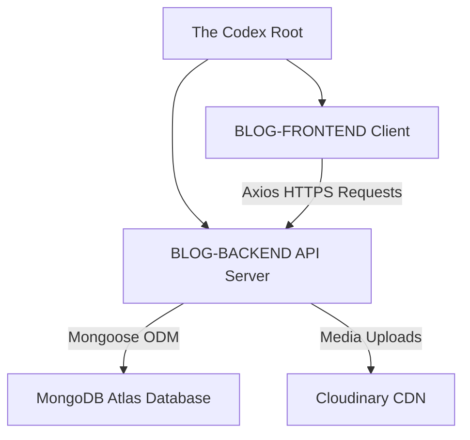

# 📜 The Codex | Gothic Literary Editorial Blog

[](https://blog-app-1-beta.vercel.app/)
[](https://blog-app-1-kny9.onrender.com)
[](https://github.com/SURVACYPRIYA/BLOG-APP-1)
[](https://mongodb.com)

Welcome to **The Codex**, an elegant, immersive multi-author blog application featuring a premium **Gothic Literary Editorial** theme. Designed for deep thinkers, classical authors, and literary enthusiasts, The Codex blends traditional publishing aesthetics (rich obsidian, deep burgundy, and soft parchment tones) with modern, robust full-stack engineering.

---

## 🎨 Theme & Aesthetic Concept

The application features a unique and highly curated aesthetic design system:
*   **Color Palette:**
    *   `Obsidian & Charcoal` (Dark mode backgrounds & sleek text boundaries)
    *   `Crimson & Burgundy` (Rich primary accents, interactive hovers, and call-to-actions)
    *   `Parchment & Ivory` (Warm, high-readability text elements mimicking classic literary prints)
*   **Typography:** Elegant serif fonts paired with high-contrast, clean sans-serif layouts to create an editorial publishing atmosphere.
*   **Animations:** Smooth, immersive transitions and delicate hover states powered by **Framer Motion** and **Tailwind CSS**.

---

## ✨ Features

### 👤 Role-Based Portals & Dashboards
The application implements three highly customized interfaces tailored to specific roles:

1.  **Reader (User) Portal:**
    *   Explore exquisite articles sorted by category.
    *   Read article details using a distraction-free editorial layout.
    *   Engage with authors through a fully-realized interactive **Comments System**.
2.  **Author Portal:**
    *   A seamless, responsive **Article Editor** supporting categorization (e.g., Programming, Literature, Philosophy).
    *   Personal Dashboard to track and manage self-authored works.
    *   Ability to **Edit**, **Soft-Delete**, or **Restore** published articles.
3.  **Administrator Portal:**
    *   High-level oversight of all system articles.
    *   Robust **Author Management**—ability to block or unblock author accounts instantly.
    *   Stateful user control ensuring security and moderation.

### 🛡️ Authentication & Security
*   Secure token-based authentication using **JSON Web Tokens (JWT)**.
*   Secure HTTP-Only Cookies for token transmission, mitigating XSS and CSRF risks.
*   Dynamic client-side route guard verification and backend authorization middleware.
*   Automated session restoration on browser refresh (`check-auth`).

---

## 🏗️ Repository Architecture

The project is structured as a mono-repository containing two decoupled MERN components:



### Decoupled Sub-projects
*   **[`BLOG-FRONTEND`](./BLOG-FRONTEND)**: Single Page Application (SPA) powered by **React 19**, **Vite**, **Zustand** (State Management), **Tailwind CSS v4** (Aesthetic Design System), and **Framer Motion**.
*   **[`BLOG-BACKEND`](./BLOG-BACKEND)**: High-performance RESTful API powered by **Node.js**, **Express**, **MongoDB** (via **Mongoose**), **Multer**, and **Cloudinary** for premium media handling.

---

## 🚀 Quick Local Setup

Follow these simple steps to run the entire stack locally:

### 1. Prerequisites
Ensure you have the following installed:
*   [Node.js](https://nodejs.org/) (Version >= 18)
*   [MongoDB](https://www.mongodb.com/try/download/community) (Local instance or Atlas URI)

### 2. Clone the Repository
```bash
git clone https://github.com/SURVACYPRIYA/BLOG-APP-1.git
cd BLOG-APP-1
```

### 3. Backend Setup
1.  Navigate to the backend directory:
    ```bash
    cd BLOG-BACKEND
    ```
2.  Install dependencies:
    ```bash
    npm install
    ```
3.  Create a `.env` file in the `BLOG-BACKEND` directory and configure your variables:
    ```env
    PORT=4000
    DB_URL=mongodb://localhost:27017/blog-backend-db
    JWT_SECRET=your_jwt_secret_key
    CLOUD_NAME=your_cloudinary_cloud_name
    API_KEY=your_cloudinary_api_key
    API_SECRET=your_cloudinary_api_secret
    ```
4.  Start the development server:
    ```bash
    npm start
    ```

### 4. Frontend Setup
1.  Open a new terminal and navigate to the frontend directory:
    ```bash
    cd BLOG-FRONTEND
    ```
2.  Install dependencies:
    ```bash
    npm install
    ```
3.  Create a `.env` file in the `BLOG-FRONTEND` directory:
    ```env
    VITE_API_URL=http://localhost:4000
    ```
4.  Start the Vite development server:
    ```bash
    npm run dev
    ```
5.  Open your browser and navigate to `http://localhost:5173`.

---

## 🌐 Production Deployment

The Codex is designed to be easily deployed to modern cloud platforms:

### 🖥️ Frontend (Vercel)
*   **Live Link:** [blog-app-1-beta.vercel.app](https://blog-app-1-beta.vercel.app/)
*   **Configuration:** Automatically connects to the main branch of your GitHub repository.
*   **Settings:**
    *   Build Command: `npm run build`
    *   Output Directory: `dist`
    *   Environment Variables:
        *   `VITE_API_URL`: `https://blog-app-1-kny9.onrender.com`

### ⚙️ Backend (Render)
*   **Live Link:** [blog-app-1-kny9.onrender.com](https://blog-app-1-kny9.onrender.com)
*   **Configuration:** Deployed as a Web Service running on Node.js.
*   **Settings:**
    *   Build Command: `npm install`
    *   Start Command: `node server.js` or `npm start`
    *   Environment Variables: Set `DB_URL` (MongoDB Atlas), `JWT_SECRET`, `CLOUD_NAME`, `API_KEY`, and `API_SECRET` under the service's Environment settings.

---

## 📜 License

This project is licensed under the [ISC License](./BLOG-BACKEND/package.json). Feel free to customize and expand it to write your own magnificent prose!
